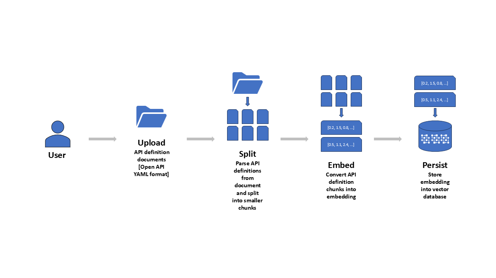
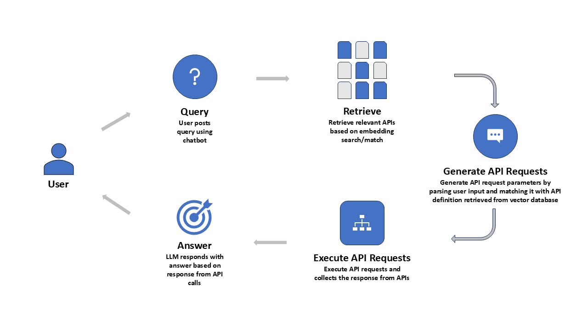

# Operations GenAIe
The 'Operations GenAIe' is a new approach to build GenAI-First approach application for enterprise users.

## Application Usage
The application users will use this new breed of application using conversational chatbot to complete business transactions, update information, and gather insights. The queries posted by end-users will be translated by LLMs into the most appropriate API (Application Programming Interface) calls available to the application to achieve the results based on user's query and provide the response back to user. This approach reduces the training requirements for application users as they no longer need to focus on how to use the applications to complete their daily operations activities. The users can let LLMs take care of **'HOW'** and focus instead of **'WHAT'** and **'WHY'**.

## Solution Overview
The following diagram shows key components in this solution and their interaction with each other in the two user process flows if using the application.

### Upload API definitions and create tools
User uploads API definitions in OpenAPI YAML format. The application extracts API details and dynamically creates callable tools from these definitions. These tools are registered and made available for LLM-driven query processing. No embeddings or vector database are used in this approach.

### Post user queries and get response from APIs
User submits queries to the chatbot. The LLM analyzes the query and selects the appropriate tool (API) from the dynamically created set. It then invokes the tool, passing extracted parameters, and presents the API response in a user-friendly format.

