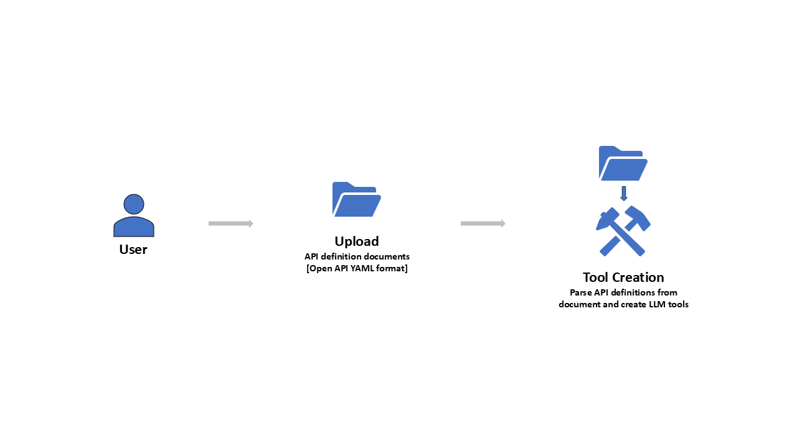

# Operations GenAIe
The 'Operations GenAIe' is a new approach to build GenAI-First approach application for enterprise users.

## Application Usage
The application users will use this new breed of application using conversational chatbot to complete business transactions, update information, and gather insights. The queries posted by end-users will be translated by LLMs into the most appropriate API (Application Programming Interface) calls available to the application to achieve the results based on user's query and provide the response back to user. This approach reduces the training requirements for application users as they no longer need to focus on how to use the applications to complete their daily operations activities. The users can let LLMs take care of **'HOW'** and focus instead of **'WHAT'** and **'WHY'**.

## Solution Overview
The following diagram shows key components in this solution and their interaction with each other in the two user process flows if using the application.

### Upload API definitions and create embeddings
User will upload the API definitions in Open API YAML format. The application will extract key details from the file and chunks into smaller chunks to generate the embedding and persist the embedding in vector database for later use.

### Post user queries and get response from APIs
User will post queries to chatbot, the LLM will parse the details from the query and identify the most appropriate API to call based on the search in vector database. Once the API is identified, the LLM will also generate request parameters by parsing the user input and match it with API definition. Then the application will call the APIs using the URL and other details retrieved from API definition. Application will collect the API response and will use LLM to generate human readable response and post it back to user in chatbot.

